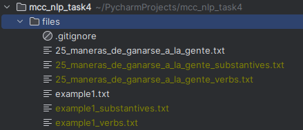

# Maestría en Ciencias de la Computación - Universidad Autónoma de Yucatán

## Natural Language Processing

### Task4: Identify substantives and verbs in a text

#### Description

From the one input file,
separate into two files,
one containing only the substantives
and the other containing only the verbs.
According to Freeling PoS labeling.

#### Response:

##### Code:

```python
import requests


# Extract Nouns and Verbs
def extract_substantives_and_verbs(file_name: str):
    files_folder: str = './files'
    file_path: str = f'{files_folder}/{file_name}.txt'
    print(f'File, {file_path}')

    set_substantives: set = set()
    set_verbs: set = set()

    # file to be sent
    files = {'file': open(file_path, 'rb')}
    # parameters to be sent with the file
    params = {'outf': 'tagged', 'format': 'json'}
    # send request
    url = "http://www.corpus.unam.mx/servicio-freeling/analyze.php"
    r = requests.post(url, files=files, params=params)
    # convert from json format
    obj = r.json()

    for sentence in obj:
        for word in sentence:
            word_token: str = word['token']
            word_type: str = word['tag'][0]
            if 'N' == word_type:
                set_substantives.add(word_token)
            elif 'V' == word_type:
                set_verbs.add(word_token)

    # Create a file for substantives
    file_substantives = open(f'{files_folder}/{file_name}_substantives.txt', 'w')
    file_substantives.truncate(0)
    for word_token in set_substantives:
        file_substantives.write(word_token + '\n')
    file_substantives.close()

    # Create a file for verbs
    file_verbs = open(f'{files_folder}/{file_name}_verbs.txt', 'w')
    file_verbs.truncate(0)
    for word_token in set_verbs:
        file_verbs.write(word_token + '\n')
    file_verbs.close()


if __name__ == '__main__':
    extract_substantives_and_verbs('example1')
    extract_substantives_and_verbs('25_maneras_de_ganarse_a_la_gente')
```

##### Output Files



###### Files Example1

Substantives

```text
universidad
estudiante
México
maestría
país

```

Verbs

```text
vivir
gustaría
Soy
gusta

```
